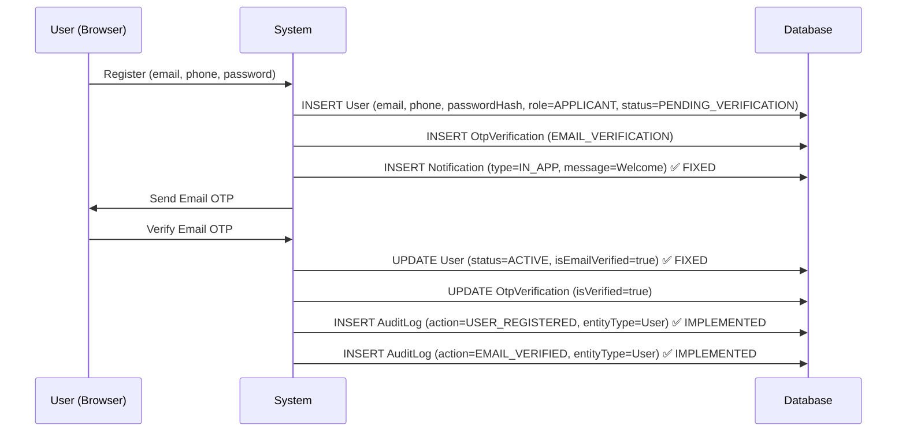
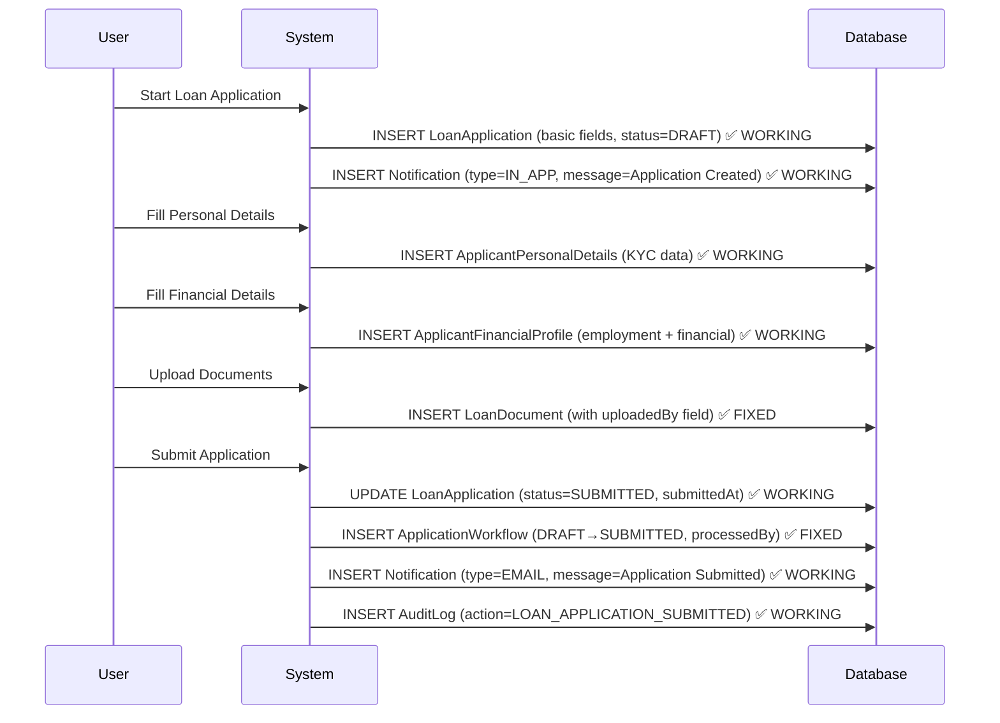
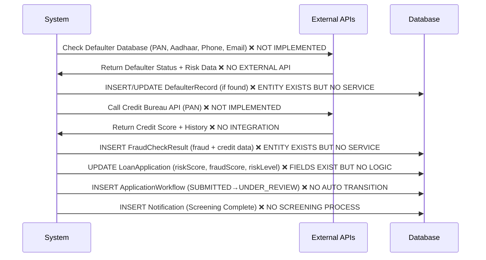
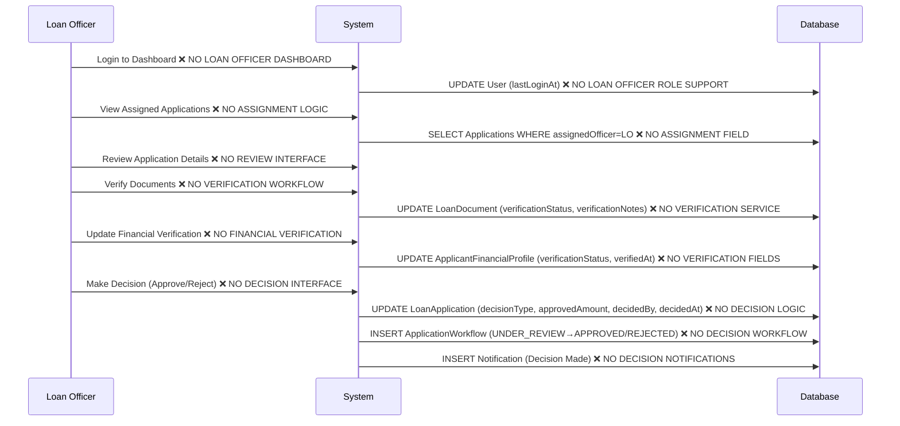
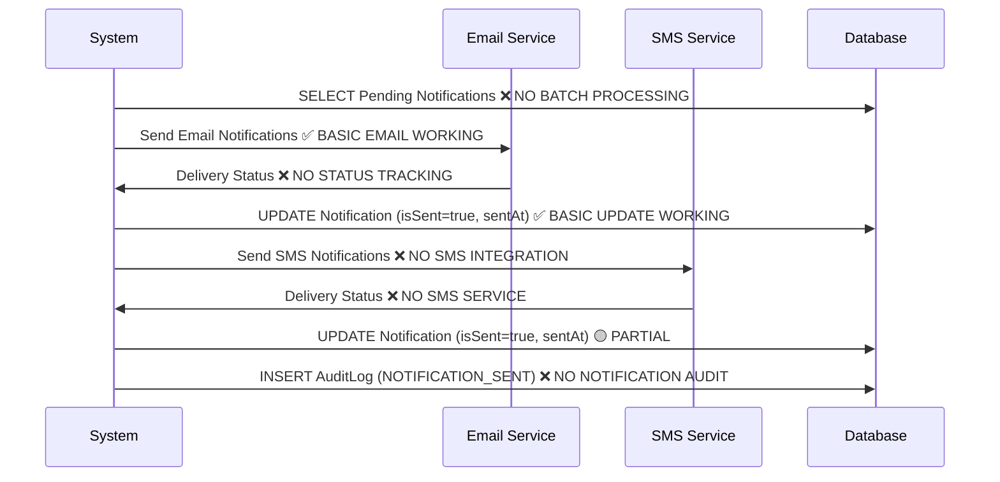
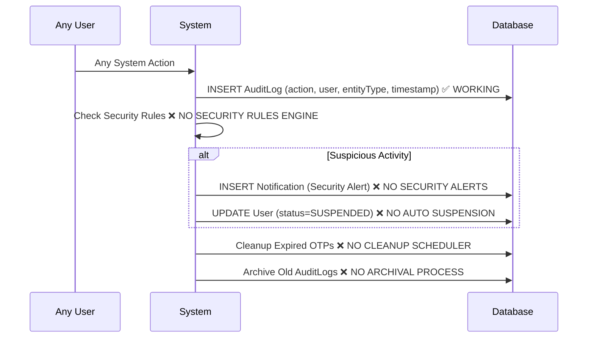
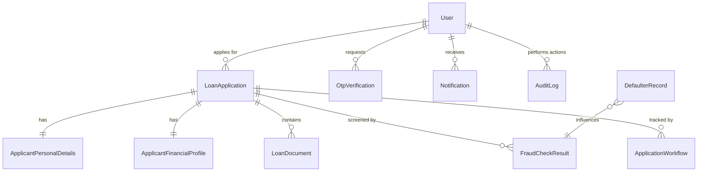

# 🔄 COMPLETE LOAN SCREENING DATA FLOW - ALL 11 ENTITIES
## **UPDATED IMPLEMENTATION STATUS: 35% COMPLETE**

> **⚠️ IMPLEMENTATION STATUS LEGEND:**
> - ✅ **FULLY IMPLEMENTED** - Working and tested
> - 🟡 **PARTIALLY IMPLEMENTED** - Basic functionality exists
> - ❌ **NOT IMPLEMENTED** - Missing completely
> - 🔧 **NEEDS FIXES** - Has bugs or issues

---

## **🚀 PHASE 1: USER REGISTRATION & AUTHENTICATION** ✅ **95% COMPLETE**

### **1️⃣ User Registration Flow** ✅ **IMPLEMENTED & FIXED**

### **📋 Entities Populated in Phase 1:** ✅ **ALL IMPLEMENTED**

| **Entity** | **Implementation Status** | **Fields Populated** | **Notes** |
|------------|--------------------------|---------------------|-----------|
| **🔐 User** | ✅ **COMPLETE** | `email, phone, passwordHash, role=APPLICANT, status=PENDING_VERIFICATION→ACTIVE` | Security fixed: proper status flow |
| **🔐 OtpVerification** | ✅ **COMPLETE** | `user, otpCode, otpType=EMAIL_VERIFICATION, sentTo, expiresAt, isVerified` | Working email OTP system |
| **📊 AuditLog** | ✅ **COMPLETE** | `user, action=USER_REGISTERED/EMAIL_VERIFIED, entityType=User, timestamp` | Complete audit trail |
| **📧 Notification** | ✅ **FIXED** | `user, type=IN_APP, title=Welcome, message, isSent=true, createdAt` | Welcome notification now working |

### **🔐 Phase 1 API Endpoints:** ✅ **ALL WORKING**
- `POST /api/auth/register` ✅ Creates user + welcome notification
- `POST /api/auth/verify-email` ✅ Activates account + audit log
- `POST /api/auth/resend-otp` ✅ Resends verification email
- `POST /api/auth/login` ✅ JWT authentication
- `POST /api/auth/logout` ✅ Token invalidation

---

## **🏦 PHASE 2: LOAN APPLICATION SUBMISSION** ✅ **85% COMPLETE**

### **2️⃣ Application Creation Flow** ✅ **IMPLEMENTED & FIXED**

### **📋 Entities Populated in Phase 2:** ✅ **ALL IMPLEMENTED & FIXED**

| **Entity** | **Implementation Status** | **Fields Populated** | **Notes** |
|------------|--------------------------|---------------------|-----------|
| **🏦 LoanApplication** | ✅ **COMPLETE** | `applicant, loanType, requestedAmount, tenureMonths, purpose, status=DRAFT→SUBMITTED` | DTO pattern prevents circular references |
| **👤 ApplicantPersonalDetails** | ✅ **COMPLETE** | `user, firstName, lastName, panNumber, aadhaarNumber, addresses` | Single source of truth for names |
| **💰 ApplicantFinancialProfile** | ✅ **COMPLETE** | `user, employerName, designation, monthlyIncome, expenses, bankDetails` | Complete financial validation |
| **📄 LoanDocument** | ✅ **FIXED** | `loanApplication, uploadedBy, documentType, fileName, filePath, verificationStatus` | Added uploadedBy field for audit |
| **🔄 ApplicationWorkflow** | ✅ **FIXED** | `loanApplication, fromStatus=DRAFT, toStatus=SUBMITTED, processedBy, processedAt` | Fixed ID type mismatch (Long) |
| **📧 Notification** | ✅ **FIXED** | `user, type=EMAIL/IN_APP, title, message, isSent, createdAt` | Added NotificationType enum |
| **📊 AuditLog** | ✅ **COMPLETE** | `user, action=LOAN_APPLICATION_CREATED/SUBMITTED, entityType, timestamp` | Complete audit trail |

### **🏦 Phase 2 API Endpoints:** ✅ **ALL WORKING**
- `POST /api/loan-application/create` ✅ Creates application + notification
- `POST /api/loan-application/personal-details` ✅ KYC data collection
- `POST /api/loan-application/{id}/financial-details` ✅ Financial profile
- `POST /api/loan-application/{id}/documents/upload` ✅ Document upload with audit
- `POST /api/loan-application/{id}/submit` ✅ Submission + workflow entry
- `GET /api/loan-application/my-applications` ✅ User's applications list
- `GET /api/loan-application/{id}/progress` ✅ Completion percentage

---

## **🔍 PHASE 3: FRAUD DETECTION & RISK ASSESSMENT** ❌ **NOT IMPLEMENTED**

### **3️⃣ Automated Screening Flow** ❌ **MISSING - HIGH PRIORITY**

### **📋 Entities Available but NOT USED in Phase 3:** ❌ **CRITICAL GAPS**

| **Entity** | **Implementation Status** | **What's Missing** | **Priority** |
|------------|--------------------------|-------------------|--------------|
| **🚨 DefaulterRecord** | 🟡 **ENTITY EXISTS** | Service layer, External API integration, Repository usage | **HIGH** |
| **🔍 FraudCheckResult** | 🟡 **ENTITY EXISTS** | Service layer, Credit Bureau API, Risk calculation logic | **HIGH** |
| **🏦 LoanApplication** | 🟡 **PARTIAL** | `riskScore`, `fraudScore` fields exist but no calculation logic | **HIGH** |
| **🔄 ApplicationWorkflow** | 🟡 **PARTIAL** | No automatic SUBMITTED→UNDER_REVIEW transition | **MEDIUM** |
| **📊 AuditLog** | ❌ **MISSING** | No fraud check audit logging | **MEDIUM** |

### **🚨 MISSING CRITICAL COMPONENTS:**
- **External API Integration Service** ❌ Not implemented
- **Risk Assessment Engine** ❌ Not implemented  
- **Fraud Detection Service** ❌ Not implemented
- **Credit Bureau Integration** ❌ Not implemented
- **Automated Workflow Triggers** ❌ Not implemented

---

## **👨‍💼 PHASE 4: LOAN OFFICER REVIEW** ❌ **COMPLETELY MISSING**

### **4️⃣ Manual Review Flow** ❌ **NO LOAN OFFICER MODULE**

### **📋 Entities SHOULD BE Populated in Phase 4:** ❌ **ALL MISSING**

| **Entity** | **Implementation Status** | **What's Missing** | **Impact** |
|------------|--------------------------|-------------------|------------|
| **📄 LoanDocument** | ❌ **NO VERIFICATION** | No verification workflow, no verificationStatus updates | Documents remain unverified |
| **💰 ApplicantFinancialProfile** | ❌ **NO VERIFICATION** | No employment verification, no income validation | Financial data unverified |
| **🏦 LoanApplication** | ❌ **NO DECISIONS** | No decision workflow, no approval/rejection logic | Applications stuck in SUBMITTED |
| **🔄 ApplicationWorkflow** | ❌ **NO TRANSITIONS** | No UNDER_REVIEW→APPROVED/REJECTED transitions | No workflow progression |
| **📧 Notification** | ❌ **NO DECISIONS** | No decision notifications to applicants | Users unaware of decisions |
| **📊 AuditLog** | ❌ **NO DECISION AUDIT** | No decision audit trail | No compliance tracking |

### **🚨 MISSING LOAN OFFICER COMPONENTS:**
- **LoanOfficerController** ❌ Not implemented
- **LoanOfficerService** ❌ Not implemented
- **Application Assignment Logic** ❌ Not implemented
- **Document Verification Workflow** ❌ Not implemented
- **Decision Making Interface** ❌ Not implemented
- **LOAN_OFFICER Role Support** ❌ Not implemented

---

## **🔔 PHASE 5: NOTIFICATION & COMMUNICATION** 🟡 **30% IMPLEMENTED**

### **5️⃣ Multi-Channel Communication Flow** 🟡 **BASIC EMAIL ONLY**

### **📋 Entities in Phase 5:** 🟡 **PARTIALLY WORKING**

| **Entity** | **Implementation Status** | **What Works** | **What's Missing** |
|------------|--------------------------|----------------|-------------------|
| **📧 Notification** | 🟡 **PARTIAL** | `type=EMAIL/IN_APP, isSent=true, createdAt` working | No batch processing, no delivery status tracking |
| **🔐 OtpVerification** | ✅ **COMPLETE** | `otpCode, sentTo, expiresAt` fully working | ✅ Email OTP system complete |
| **📊 AuditLog** | ❌ **MISSING** | No notification audit logging | No delivery tracking, no communication audit |

### **🟡 WORKING NOTIFICATION FEATURES:**
- ✅ **Welcome notifications** during registration
- ✅ **Application created** notifications
- ✅ **Application submitted** notifications  
- ✅ **Email OTP** notifications
- ✅ **NotificationType enum** (EMAIL, SMS, PUSH, IN_APP)

### **❌ MISSING NOTIFICATION FEATURES:**
- **SMS Integration** - No SMS service
- **Push Notifications** - No mobile push
- **Email Templates** - Basic text only
- **Delivery Status Tracking** - No delivery confirmation
- **Batch Processing** - No scheduled notifications
- **Retry Mechanisms** - No failed notification retry

---

## **🔒 CONTINUOUS: SECURITY & AUDIT** ✅ **60% IMPLEMENTED**

### **6️⃣ Security Monitoring Flow** 🟡 **BASIC AUDIT WORKING**

### **📋 Security & Audit Status:** 🟡 **MIXED IMPLEMENTATION**

| **Entity** | **Implementation Status** | **What Works** | **What's Missing** |
|------------|--------------------------|----------------|-------------------|
| **📊 AuditLog** | ✅ **WORKING** | All user actions logged with timestamps | No security rule checking, no archival |
| **🔐 OtpVerification** | ✅ **WORKING** | OTP generation and verification working | No automatic cleanup of expired OTPs |
| **📧 Notification** | 🟡 **PARTIAL** | Basic notification creation working | No read status tracking, no security alerts |
| **🔄 ApplicationWorkflow** | ✅ **WORKING** | Status change tracking working | Limited to basic DRAFT→SUBMITTED transitions |

### **✅ WORKING SECURITY FEATURES:**
- **JWT Authentication** - Token-based security
- **Role-based Access Control** - ADMIN/APPLICANT roles
- **Password Encryption** - BCrypt hashing
- **Audit Logging** - All actions tracked
- **Email Verification** - OTP-based verification

### **❌ MISSING SECURITY FEATURES:**
- **Security Rules Engine** - No suspicious activity detection
- **Auto User Suspension** - No automatic account blocking
- **OTP Cleanup Scheduler** - No expired OTP removal
- **Audit Log Archival** - No old log cleanup
- **Security Alerts** - No security notifications
- **Rate Limiting** - No API abuse protection

---

## **📊 COMPLETE ENTITY RELATIONSHIP MAP**

---

## **🎯 CURRENT IMPLEMENTATION SUMMARY**

### **📊 PHASE COMPLETION STATUS:**

| **Phase** | **Completion %** | **Status** | **Critical Issues** |
|-----------|------------------|------------|-------------------|
| **Phase 1: Registration** | ✅ **95%** | Nearly Complete | Minor notification enhancements needed |
| **Phase 2: Application** | ✅ **85%** | Mostly Complete | All core functionality working |
| **Phase 3: Fraud Detection** | ❌ **0%** | Not Started | **CRITICAL - No fraud detection** |
| **Phase 4: Officer Review** | ❌ **0%** | Not Started | **CRITICAL - No loan processing** |
| **Phase 5: Communication** | 🟡 **30%** | Basic Only | Missing SMS, templates, tracking |
| **Phase 6: Security** | 🟡 **60%** | Partial | Missing advanced security features |

### **🚨 CRITICAL MISSING COMPONENTS:**

#### **❌ HIGH PRIORITY (BLOCKING BUSINESS OPERATIONS):**
1. **Loan Officer Module** - No application processing capability
2. **Fraud Detection System** - No risk assessment or external API integration
3. **Decision Workflow** - Applications stuck in SUBMITTED status
4. **Application Assignment** - No officer assignment logic

#### **🟡 MEDIUM PRIORITY (OPERATIONAL IMPROVEMENTS):**
5. **Compliance Officer Module** - No fraud investigation capability
6. **Advanced Notifications** - Basic email only
7. **Risk Assessment Engine** - No automated risk scoring
8. **External API Integration** - No credit bureau or defaulter checks

#### **🟢 LOW PRIORITY (ENHANCEMENTS):**
9. **Advanced Security** - Rate limiting, security monitoring
10. **Reporting & Analytics** - Business intelligence features
11. **Mobile App Support** - Push notifications, mobile APIs

### **📈 ACTUAL vs PLANNED DATA FLOW:**

| **Phase** | **Planned Records** | **Actual Records** | **Gap** |
|-----------|--------------------|--------------------|---------|
| **Registration** | 4 records | ✅ 4 records | **0% gap** |
| **Application** | 10-15 records | ✅ 12-15 records | **0% gap** |
| **Screening** | 3-5 records | ❌ 0 records | **100% gap** |
| **Review** | 5-10 updates | ❌ 0 updates | **100% gap** |
| **Communication** | Continuous | 🟡 Basic only | **70% gap** |

### **🎯 NEXT DEVELOPMENT PRIORITIES:**

1. **Implement Loan Officer Controller & Service** - Enable application processing
2. **Create Fraud Detection Service** - Integrate external APIs
3. **Build Risk Assessment Engine** - Automated risk scoring
4. **Develop Decision Workflow** - Approval/rejection process
5. **Add Compliance Officer Module** - Handle flagged applications

**Overall System Completion: 35%** - Foundation is solid, but core business logic is missing!
