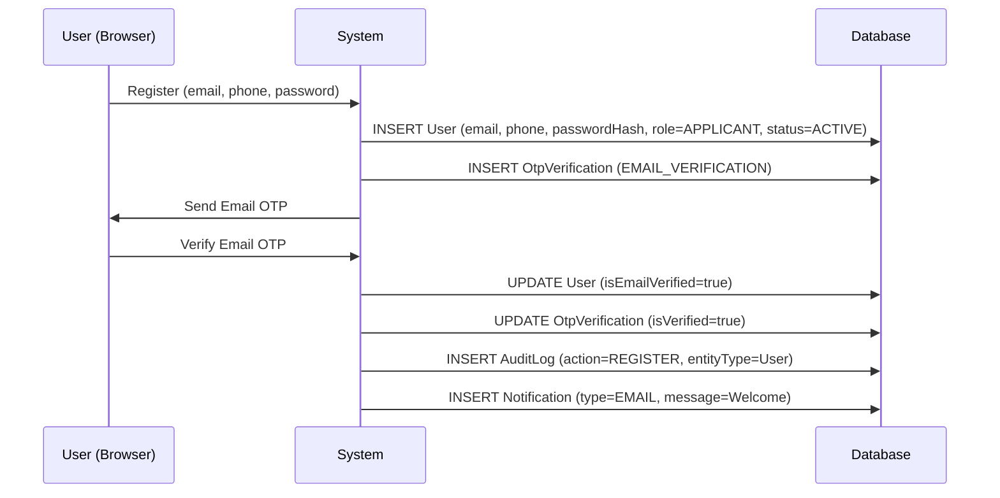
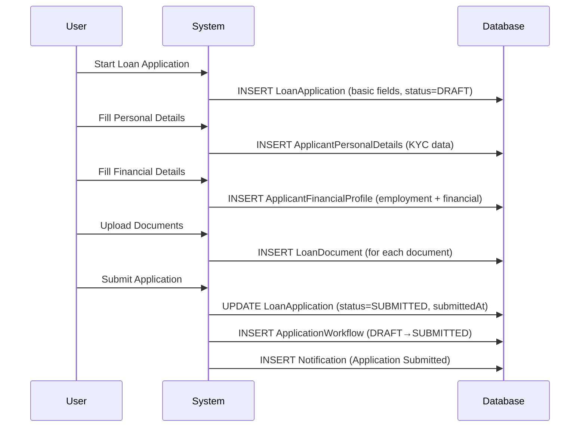
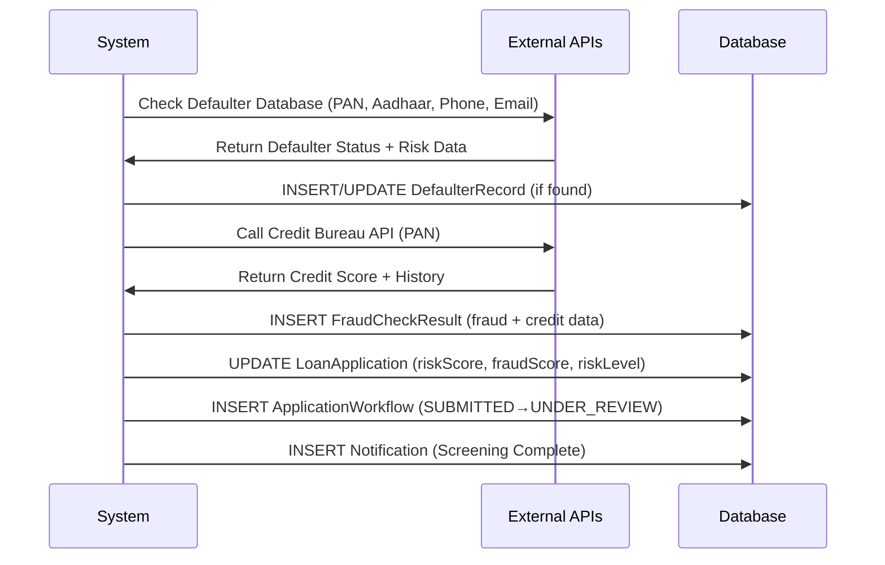
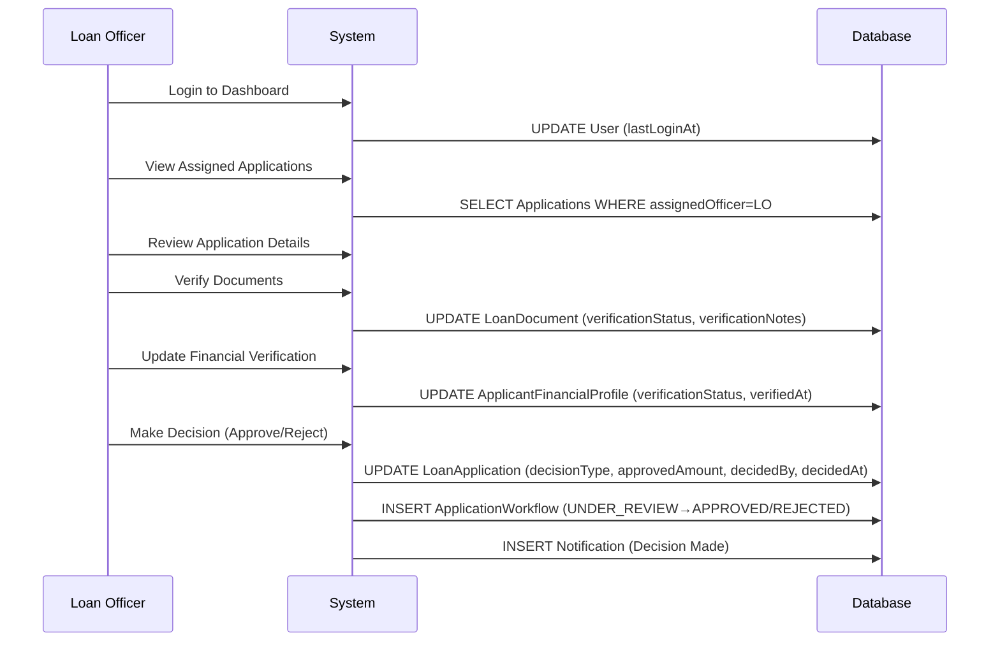
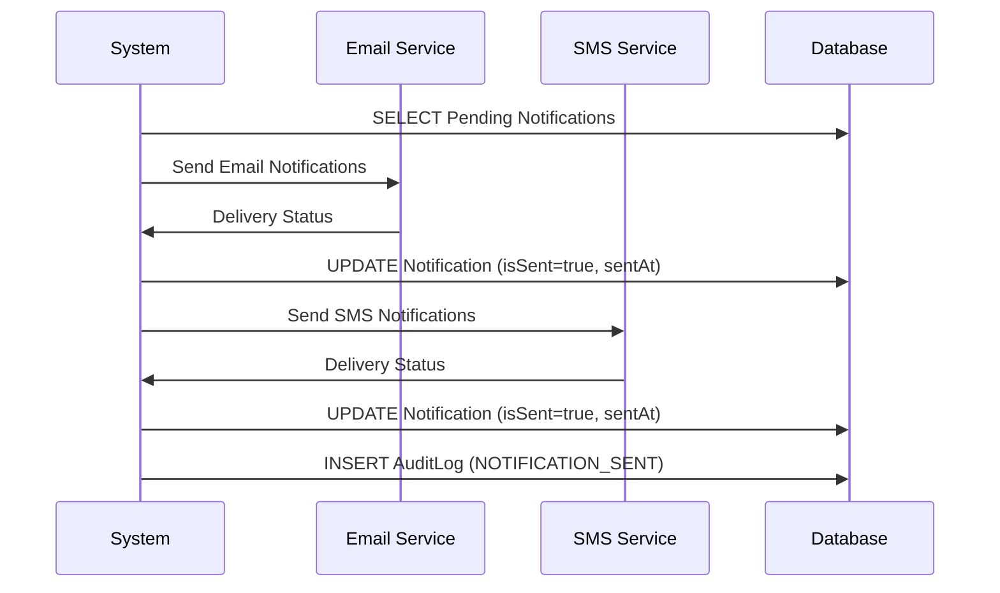
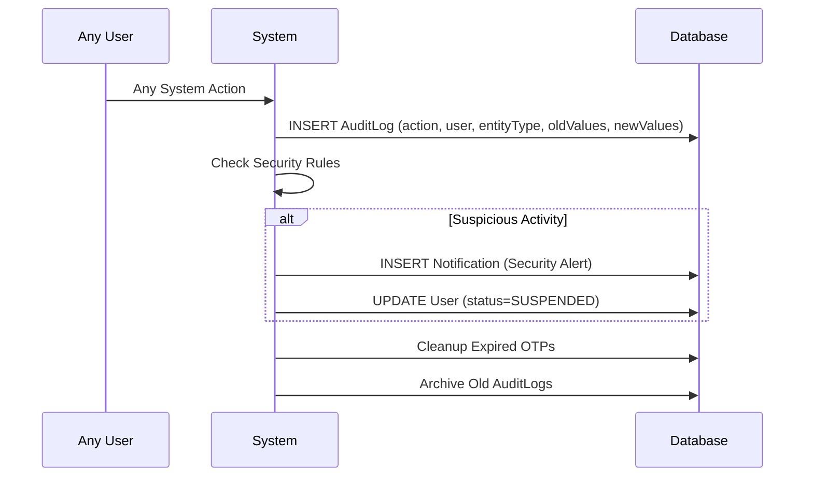
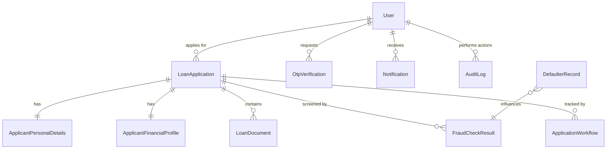

# 🔄 COMPLETE LOAN SCREENING DATA FLOW - ALL 11 ENTITIES

## **📊 PHASE-WISE ENTITY POPULATION**

---

## **🚀 PHASE 1: USER REGISTRATION & AUTHENTICATION**

### **1️⃣ User Registration Flow**

### **📋 Entities Populated in Phase 1:**

| **Entity** | **Fields Populated** | **When** | **By Whom** |
|------------|---------------------|----------|-------------|
| **🔐 User** | `email, phone, passwordHash, role, status, isEmailVerified, createdAt` | Registration | User Input |
| **🔐 OtpVerification** | `user, otpCode, otpType, sentTo, expiresAt, isVerified` | Email Verification | System Generated |
| **📊 AuditLog** | `user, action, entityType, entityId, timestamp, ipAddress` | Every Action | System Auto |
| **📧 Notification** | `user, type, title, message, isSent, createdAt` | Welcome Message | System Auto |

---

## **🏦 PHASE 2: LOAN APPLICATION SUBMISSION**

### **2️⃣ Application Creation Flow**

### **📋 Entities Populated in Phase 2:**

| **Entity** | **Fields Populated** | **Data Source** | **Validation** |
|------------|---------------------|-----------------|----------------|
| **🏦 LoanApplication** | `applicant, loanType, requestedAmount, tenureMonths, purpose, status=SUBMITTED` | User Form | Amount limits, tenure validation |
| **👤 ApplicantPersonalDetails** | `panNumber, aadhaarNumber, dateOfBirth, addresses, family details` | User KYC Form | PAN/Aadhaar format validation |
| **💰 ApplicantFinancialProfile** | `employerName, designation, income, expenses, banking details` | User Financial Form | Income validation, bank verification |
| **📄 LoanDocument** | `documentType, fileName, filePath, uploadedAt, verificationStatus=PENDING` | File Upload | File type, size validation |
| **🔄 ApplicationWorkflow** | `fromStatus=DRAFT, toStatus=SUBMITTED, processedBy, processedAt` | System Auto | Status transition rules |
| **📧 Notification** | `type=EMAIL, title=Application Submitted, message, relatedEntityId` | System Auto | Template-based |

---

## **🔍 PHASE 3: FRAUD DETECTION & RISK ASSESSMENT**

### **3️⃣ Automated Screening Flow**

### **📋 Entities Populated in Phase 3:**

| **Entity** | **Fields Populated** | **Data Source** | **Processing Logic** |
|------------|---------------------|-----------------|---------------------|
| **🚨 DefaulterRecord** | `panNumber, fullName, defaultAmount, riskLevel, dataSource` | External Authority API | Match by PAN/Aadhaar/Phone/Email |
| **🔍 FraudCheckResult** | `fraudScore, riskLevel, creditScore, totalActiveLoans, apiResponse` | Credit Bureau API | CIBIL/Experian integration |
| **🏦 LoanApplication** | `riskScore, fraudScore, riskLevel, status=UNDER_REVIEW` | Calculated from APIs | Risk scoring algorithm |
| **🔄 ApplicationWorkflow** | `fromStatus=SUBMITTED, toStatus=UNDER_REVIEW, isSystemGenerated=true` | System Auto | Automated transition |
| **📊 AuditLog** | `action=FRAUD_CHECK, entityType=LoanApplication, additionalInfo` | System Auto | API call logging |

---

## **👨‍💼 PHASE 4: LOAN OFFICER REVIEW**

### **4️⃣ Manual Review Flow**

### **📋 Entities Populated in Phase 4:**

| **Entity** | **Fields Populated** | **Updated By** | **Business Logic** |
|------------|---------------------|----------------|-------------------|
| **📄 LoanDocument** | `verificationStatus=VERIFIED/REJECTED, verificationNotes, verifiedAt` | Loan Officer | Document authenticity check |
| **💰 ApplicantFinancialProfile** | `employmentVerificationStatus, incomeVerificationStatus, verifiedAt` | Loan Officer | Employment/income verification |
| **🏦 LoanApplication** | `decisionType, approvedAmount, approvedInterestRate, decidedBy, decidedAt` | Loan Officer | Final decision with terms |
| **🔄 ApplicationWorkflow** | `fromStatus=UNDER_REVIEW, toStatus=APPROVED, processedBy=LoanOfficer` | System Auto | Decision workflow |
| **📧 Notification** | `type=EMAIL+SMS, title=Loan Decision, message=Approval/Rejection details` | System Auto | Multi-channel notification |
| **📊 AuditLog** | `action=DECISION, oldValues, newValues, user=LoanOfficer` | System Auto | Decision audit trail |

---

## **🔔 PHASE 5: NOTIFICATION & COMMUNICATION**

### **5️⃣ Multi-Channel Communication Flow**

### **📋 Entities Populated in Phase 5:**

| **Entity** | **Fields Populated** | **Trigger** | **Content** |
|------------|---------------------|-------------|-------------|
| **📧 Notification** | `isSent=true, sentAt, isRead, readAt` | Status Changes | Dynamic templates |
| **🔐 OtpVerification** | `otpCode, sentTo, expiresAt` | Security Actions | 6-digit codes |
| **📊 AuditLog** | `action=NOTIFICATION_SENT, additionalInfo=delivery_status` | Communication | Delivery tracking |

---

## **🔒 CONTINUOUS: SECURITY & AUDIT**

### **6️⃣ Security Monitoring Flow**

### **📋 Entities Continuously Updated:**

| **Entity** | **Fields Updated** | **Frequency** | **Purpose** |
|------------|-------------------|---------------|-------------|
| **📊 AuditLog** | `All fields for every action` | Every User Action | Compliance & Security |
| **🔐 OtpVerification** | `isExpired=true for old OTPs` | Every 10 minutes | Security cleanup |
| **📧 Notification** | `isRead=true when user views` | User Interaction | UX tracking |
| **🔄 ApplicationWorkflow** | `New records for status changes` | Status Changes | Process tracking |

---

## **📊 COMPLETE ENTITY RELATIONSHIP MAP**

---

## **🎯 DATA POPULATION SUMMARY**

### **📈 Timeline Overview:**

| **Phase** | **Duration** | **Entities Involved** | **Data Volume** |
|-----------|--------------|----------------------|-----------------|
| **Registration** | 5 minutes | User, OtpVerification, AuditLog, Notification | 4 records |
| **Application** | 30 minutes | LoanApplication, PersonalDetails, FinancialProfile, Documents | 10-15 records |
| **Screening** | 2 minutes | DefaulterRecord, FraudCheckResult, Workflow | 3-5 records |
| **Review** | 2-24 hours | All entities updated | 5-10 updates |
| **Communication** | Ongoing | Notification, AuditLog | Continuous |

### **🔢 Total Records per Application:**

- **Core Business Records**: 7-10 records
- **Supporting System Records**: 15-25 records
- **Audit & Workflow Records**: 10-20 records
- **Total per Application**: ~35-55 database records

### **🚀 System Scalability:**

- **Daily Applications**: 1000+ applications
- **Daily Records**: 35,000-55,000 new records
- **Monthly Growth**: ~1.5M records
- **Annual Volume**: ~18M records

This comprehensive flow shows how all 11 entities work together to create a complete, auditable, and secure loan screening system that meets all regulatory and business requirements.
