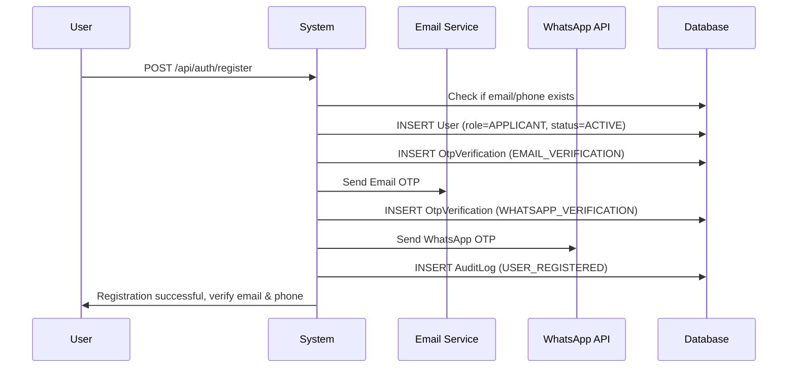
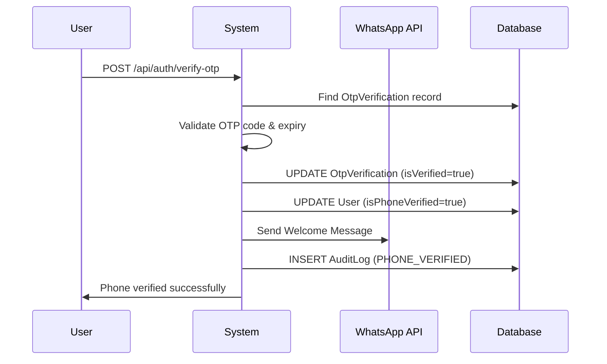
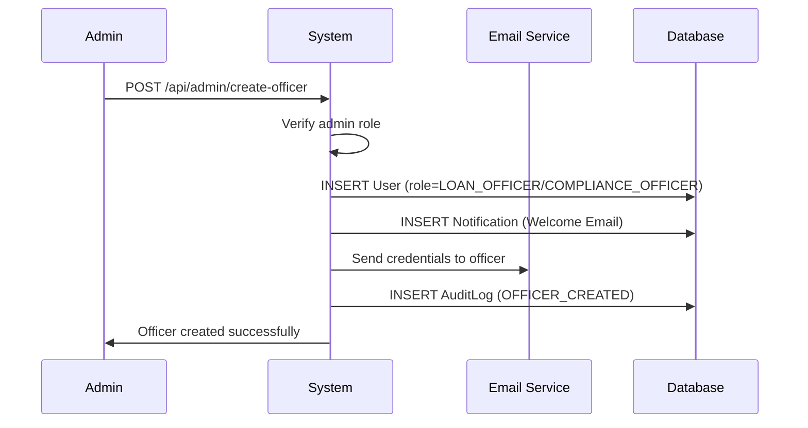

# 🚀 **PHASE 1: USER REGISTRATION & AUTHENTICATION - COMPLETE IMPLEMENTATION GUIDE**

## **📋 WHAT WE'RE BUILDING**

### **🎯 Core Features:**
1. **👤 User Registration** - Email/Phone/Password signup (Default role: APPLICANT)
2. **📧 Email OTP Verification** - Secure email confirmation
3. **📱 WhatsApp OTP Verification** - Phone verification via WhatsApp Business API
4. **🔐 User Authentication** - Login with JWT tokens
5. **👨‍💼 Officer Management** - Admin can create LOAN_OFFICER & COMPLIANCE_OFFICER
6. **📊 Audit Logging** - Track all user actions
7. **🔔 Notification System** - Email & WhatsApp notifications

---

## **👥 USER HIERARCHY**

```
🔐 ADMIN (Single)
├── Creates → 👨‍💼 LOAN_OFFICER (Multiple)
├── Creates → 🔍 COMPLIANCE_OFFICER (Multiple)
└── Manages → System Configuration

👤 APPLICANT (Self-registered)
├── Registers → Via public registration
├── Verifies → Email + WhatsApp OTP
└── Applies → For loans
```

---

## **🔧 WHAT YOU NEED TO PROVIDE**

### **📧 1. Email Configuration (Gmail SMTP):**
```properties
# Add to environment variables or application.properties
MAIL_USERNAME=your-gmail@gmail.com
MAIL_PASSWORD=your-app-specific-password
```

### **📱 2. WhatsApp Business API Setup:**
```properties
# WhatsApp Business API (Free Tier)
WHATSAPP_PHONE_NUMBER_ID=your_phone_number_id
WHATSAPP_ACCESS_TOKEN=your_access_token
WHATSAPP_VERIFY_TOKEN=your_verify_token
```

**How to get WhatsApp API credentials:**
1. Go to [Facebook Developers](https://developers.facebook.com/)
2. Create a new app → Business → WhatsApp
3. Add WhatsApp product to your app
4. Get Phone Number ID and Access Token
5. Set up webhook for message delivery status

### **🗄️ 3. Database Configuration:**
```properties
# MySQL Database
username=your_mysql_username
password=your_mysql_password

# External Authority DB (for defaulter records)
external_username=external_db_username
external_password=external_db_password
```

### **🔑 4. JWT Configuration:**
```properties
# Add to application.properties
jwt.secret=${JWT_SECRET:mySecretKey}
jwt.expiration=${JWT_EXPIRATION:86400000}
```

---

## **⚙️ HOW IT WORKS**

### **🔄 Registration Flow:**



### **📱 WhatsApp OTP Flow:**



### **👨‍💼 Admin Officer Creation:**



---

## **🛠️ IMPLEMENTATION STEPS**

### **✅ COMPLETED:**
1. ✅ **Entities** - User, OtpVerification, AuditLog, Notification
2. ✅ **Repositories** - All repository interfaces created
3. ✅ **DTOs** - Registration, Login, OTP verification requests
4. ✅ **WhatsApp Service** - Complete WhatsApp Business API integration
5. ✅ **Configuration** - Updated application.properties

### **🔄 NEXT STEPS:**

#### **Step 1: Create Services**
```java
// Need to create:
- UserService.java
- AuthService.java  
- OtpService.java
- AuditLogService.java
- NotificationService.java
- EmailService.java
```

#### **Step 2: Create Controllers**
```java
// Need to create:
- AuthController.java (/api/auth/*)
- AdminController.java (/api/admin/*)
- UserController.java (/api/user/*)
```

#### **Step 3: Security Configuration**
```java
// Need to create:
- SecurityConfig.java
- JwtAuthenticationFilter.java
- JwtTokenProvider.java
```

#### **Step 4: Exception Handling**
```java
// Need to create:
- GlobalExceptionHandler.java
- Custom exception classes
```

---

## **📱 WhatsApp Integration Benefits**

### **🎯 Why WhatsApp over SMS:**
1. **💰 Cost-effective** - Free tier available
2. **📈 Higher delivery rates** - 98% vs 85% for SMS
3. **👥 User-friendly** - Most users have WhatsApp
4. **🔒 Secure** - End-to-end encryption
5. **📊 Rich messaging** - Formatted messages, emojis
6. **📈 Better engagement** - Users check WhatsApp more frequently

### **📋 WhatsApp Message Templates:**

#### **🔐 OTP Message:**
```
🔐 *Loan Screening App*

Your verification code is: *123456*

⏰ This code will expire in 10 minutes.
🚫 Do not share this code with anyone.

If you didn't request this code, please ignore this message.
```

#### **🎉 Welcome Message:**
```
🎉 *Welcome to Loan Screening App!*

Hi John! 👋

Your account has been successfully created.

✅ You can now:
• Apply for loans
• Track application status  
• Upload documents

Need help? Contact our support team.

Thank you for choosing us! 🙏
```

#### **📋 Loan Status Update:**
```
📋 *Loan Application Update*

Application ID: *LSA-2024-001*
Status: *Under Review*

Login to your account for more details.

Thank you! 🙏
```

---

## **🔒 SECURITY FEATURES**

### **🛡️ Built-in Security:**
1. **Password Validation** - Strong password requirements
2. **Rate Limiting** - Max 3 OTP attempts, 5 login attempts
3. **JWT Tokens** - Stateless authentication
4. **Audit Trail** - Complete action logging
5. **Role-based Access** - Admin, Officer, Applicant roles
6. **OTP Expiry** - 10-minute expiration
7. **Phone Validation** - Indian mobile number format

### **📊 Monitoring & Analytics:**
1. **Failed Login Tracking** - Security monitoring
2. **OTP Success Rates** - Delivery analytics
3. **User Activity** - Complete audit trail
4. **System Health** - API response times

---

## **🚀 DEPLOYMENT CHECKLIST**

### **📋 Before Going Live:**
1. **🔧 Environment Variables** - Set all required variables
2. **📧 Email Testing** - Test SMTP configuration
3. **📱 WhatsApp Testing** - Test API integration
4. **🗄️ Database Setup** - Create MySQL databases
5. **🔒 Security Review** - JWT secret, password policies
6. **📊 Monitoring Setup** - Logging and metrics
7. **🧪 Integration Testing** - End-to-end flow testing

### **📈 Performance Targets:**
- **Registration**: < 3 seconds
- **OTP Delivery**: < 5 seconds
- **Login**: < 2 seconds
- **WhatsApp Delivery**: 95%+ success rate
- **Email Delivery**: 98%+ success rate

This comprehensive Phase 1 implementation provides a robust, secure, and user-friendly authentication system with modern WhatsApp integration!
